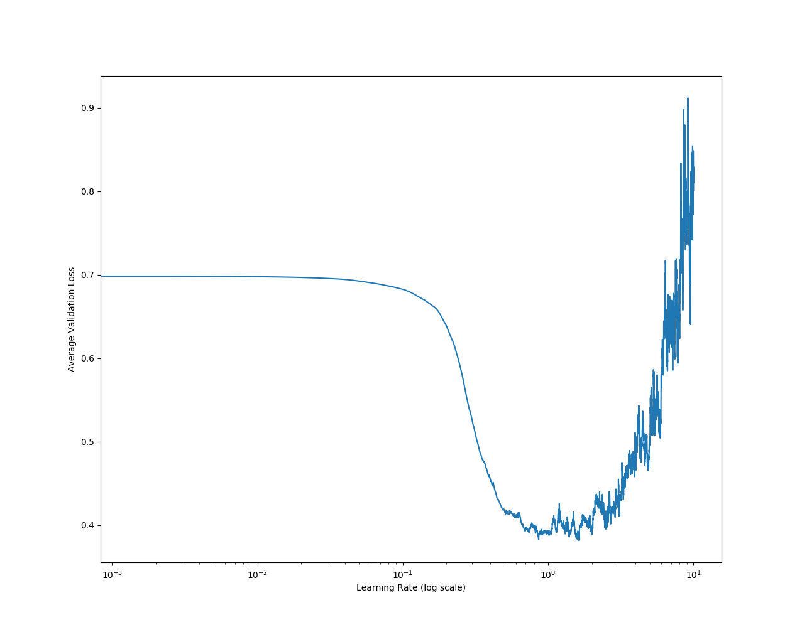
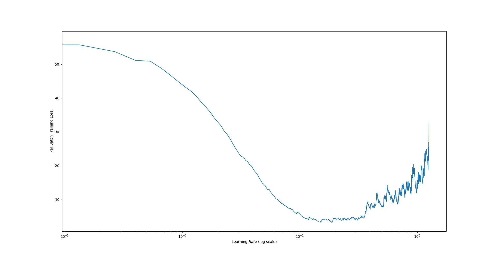
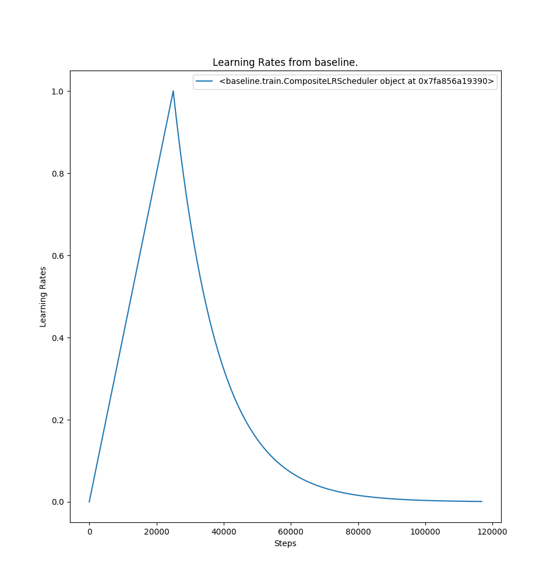
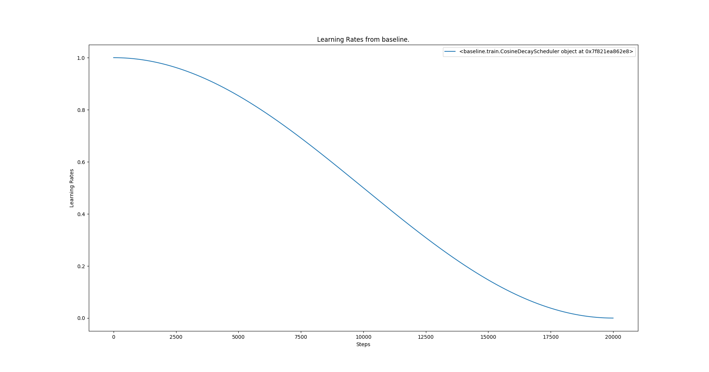

# Scripts

A collection of tools for working with baseline.

## Learning Rate exploration

#### `lr_find.py`

This implements the learning rate finder from [Cyclical Learning Rates for Training Neural Networks (Smith, 2017)](https://arxiv.org/abs/1506.01186). This takes most of the parameters of `mead-train` and will generate a plot like those below. The idea is to choose a learning rate where the decrease in the loss is steepest. This works for classification and tagging in pytorch and tensorflow.

| Kim ConvNet for SST2 | Our Tagger for CONLL2003 |
|:-|:-|
|||

#### `lr_visualize.py`

This takes the parameters that the various learning rate schedulers do and plot it over time to give you an idea of what your learning rate will look like.

| Warmup and Exponential Decay | Cosine Decay |
|:-|:-|
|||

This also saves the lr values to a cache so that they can be compared

#### `lr_compare.py`

This simply reads from the cache created by multiple runs of `lr_visualize.py` and plots them together for easy comparison.

### `speed_tests.py`

#### `python speed_tests.py run`

This runs a speed test and saves the results to a database.

 * `--config` Location of a config file or a directory of config files. If it is a directory it runs all configs inside it.
 * `--single` Run the config verbatim, don't rotate frameworks.
 * `--db` The database name to save results is (currently only sqlite)
 * `--trials` The number of times to run each config.
 * `--frameworks` A list of frameworks to run with this config.
 * It supports most of the `mead-train` arguments to find datasets and the like.

Running `python speed_tests.py run --config speed_configs/sst2.json --frameworks dynet pytorch` will run the sst2.json model with dynet and then pytorch.

#### `python speed_tests.py add`

This adds speed results to the database. This assume that you ran the model on the same environment as you are adding it from.

 * `--config` The config it was run with.
 * `--log` The location of the log file.
 * `--db` The database to save into.
 * `--gpu` The gpu to get info about.

#### `python speed_tests.py report`

Generate a speed test report from the database, It groups runs by things like config and framework version. It also only reports on the most recent software versions.

 * `--db` The database.
 * `--out` The name of the output file.

_Note: Report uses `pdflatex` and imagemagik `convert` to generate png files for the markdown report so this might fail if you don't have them installed._

#### `python speed_tests.py query`

Interface to pull specific information out of the database.

 * `--db` The database.
 * `--task` The task you want information about.
 * `--dataset` The dataset you want information about.
 * `--frameworks` The list of frameworks you want info about.
 * `--models` The models you want info about.

Frameworks and Models will be populated by the database is you don't supply them.

#### `python speed_tests.py explore`

Create the results table in the database so that you can query it easier.

 * `--db` The database.
