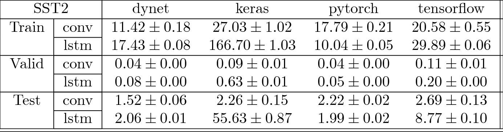
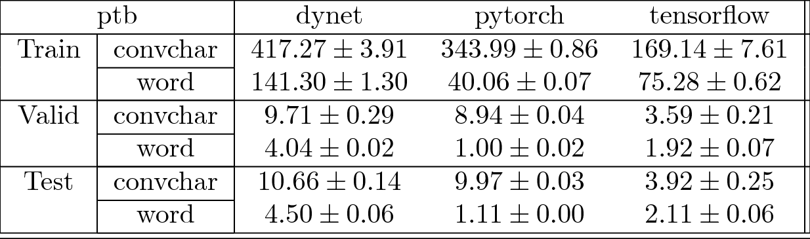

# Speed Tests

This is a speed test of different baseline models and frameworks.

## classify

Environment

These results were runs on the following configurations:

 * dynet - conv
    * framework - 2.0.3
    * baseline - 0.5.2
    * cuda - 9.0.176
    * cudnn - 7.0.5
    * python - 3.6.6
    * gpu_name - GeForce GTX 1070 with Max-Q Design
    * gpu_mem - 8114.0
    * cpu_name - Intel(R) Core(TM) i7-7700HQ CPU @ 2.80GHz
    * cpu_mem - 32051.0
    * cpu_cores - 8
 * dynet - lstm
    * framework - 2.0.3
    * baseline - 0.5.2
    * cuda - 9.0.176
    * cudnn - 7.0.5
    * python - 3.6.6
    * gpu_name - GeForce GTX 1070 with Max-Q Design
    * gpu_mem - 8114.0
    * cpu_name - Intel(R) Core(TM) i7-7700HQ CPU @ 2.80GHz
    * cpu_mem - 32051.0
    * cpu_cores - 8
 * keras - conv
    * framework - 2.2.2
    * baseline - 0.5.2
    * cuda - 9.0.176
    * cudnn - 7.0.5
    * python - 3.6.6
    * gpu_name - GeForce GTX 1070 with Max-Q Design
    * gpu_mem - 8114.0
    * cpu_name - Intel(R) Core(TM) i7-7700HQ CPU @ 2.80GHz
    * cpu_mem - 32051.0
    * cpu_cores - 8
 * keras - lstm
    * framework - 2.2.2
    * baseline - 0.5.2
    * cuda - 9.0.176
    * cudnn - 7.0.5
    * python - 3.6.6
    * gpu_name - GeForce GTX 1070 with Max-Q Design
    * gpu_mem - 8114.0
    * cpu_name - Intel(R) Core(TM) i7-7700HQ CPU @ 2.80GHz
    * cpu_mem - 32051.0
    * cpu_cores - 8
 * pytorch - conv
    * framework - 0.4.1
    * baseline - 0.5.2
    * cuda - 9.0.176
    * cudnn - 7.1.2
    * python - 3.6.6
    * gpu_name - GeForce GTX 1070 with Max-Q Design
    * gpu_mem - 8114.0
    * cpu_name - Intel(R) Core(TM) i7-7700HQ CPU @ 2.80GHz
    * cpu_mem - 32051.0
    * cpu_cores - 8
 * pytorch - lstm
    * framework - 0.4.1
    * baseline - 0.5.2
    * cuda - 9.0.176
    * cudnn - 7.1.2
    * python - 3.6.6
    * gpu_name - GeForce GTX 1070 with Max-Q Design
    * gpu_mem - 8114.0
    * cpu_name - Intel(R) Core(TM) i7-7700HQ CPU @ 2.80GHz
    * cpu_mem - 32051.0
    * cpu_cores - 8
 * tensorflow - conv
    * framework - 1.8.0
    * baseline - 0.5.2
    * cuda - 9.0.176
    * cudnn - 7.0.5
    * python - 3.6.6
    * gpu_name - GeForce GTX 1070 with Max-Q Design
    * gpu_mem - 8114.0
    * cpu_name - Intel(R) Core(TM) i7-7700HQ CPU @ 2.80GHz
    * cpu_mem - 32051.0
    * cpu_cores - 8
 * tensorflow - lstm
    * framework - 1.8.0
    * baseline - 0.5.2
    * cuda - 9.0.176
    * cudnn - 7.0.5
    * python - 3.6.6
    * gpu_name - GeForce GTX 1070 with Max-Q Design
    * gpu_mem - 8114.0
    * cpu_name - Intel(R) Core(TM) i7-7700HQ CPU @ 2.80GHz
    * cpu_mem - 32051.0
    * cpu_cores - 8

## lm

Environment

These results were runs on the following configurations:

 * dynet - convchar
    * framework - 2.0.3
    * baseline - 0.5.2
    * cuda - 9.0.176
    * cudnn - 7.0.5
    * python - 3.6.6
    * gpu_name - GeForce GTX 1070 with Max-Q Design
    * gpu_mem - 8114.0
    * cpu_name - Intel(R) Core(TM) i7-7700HQ CPU @ 2.80GHz
    * cpu_mem - 32051.0
    * cpu_cores - 8
 * dynet - word
    * framework - 2.0.3
    * baseline - 0.5.2
    * cuda - 9.0.176
    * cudnn - 7.0.5
    * python - 3.6.6
    * gpu_name - GeForce GTX 1070 with Max-Q Design
    * gpu_mem - 8114.0
    * cpu_name - Intel(R) Core(TM) i7-7700HQ CPU @ 2.80GHz
    * cpu_mem - 32051.0
    * cpu_cores - 8
 * pytorch - convchar
    * framework - 0.4.1
    * baseline - 0.5.2
    * cuda - 9.0.176
    * cudnn - 7.1.2
    * python - 3.6.6
    * gpu_name - GeForce GTX 1070 with Max-Q Design
    * gpu_mem - 8114.0
    * cpu_name - Intel(R) Core(TM) i7-7700HQ CPU @ 2.80GHz
    * cpu_mem - 32051.0
    * cpu_cores - 8
 * pytorch - word
    * framework - 0.4.1
    * baseline - 0.5.2
    * cuda - 9.0.176
    * cudnn - 7.1.2
    * python - 3.6.6
    * gpu_name - GeForce GTX 1070 with Max-Q Design
    * gpu_mem - 8114.0
    * cpu_name - Intel(R) Core(TM) i7-7700HQ CPU @ 2.80GHz
    * cpu_mem - 32051.0
    * cpu_cores - 8
 * tensorflow - convchar
    * framework - 1.8.0
    * baseline - 0.5.2
    * cuda - 9.0.176
    * cudnn - 7.0.5
    * python - 3.6.6
    * gpu_name - GeForce GTX 1070 with Max-Q Design
    * gpu_mem - 8114.0
    * cpu_name - Intel(R) Core(TM) i7-7700HQ CPU @ 2.80GHz
    * cpu_mem - 32051.0
    * cpu_cores - 8
 * tensorflow - word
    * framework - 1.8.0
    * baseline - 0.5.2
    * cuda - 9.0.176
    * cudnn - 7.0.5
    * python - 3.6.6
    * gpu_name - GeForce GTX 1070 with Max-Q Design
    * gpu_mem - 8114.0
    * cpu_name - Intel(R) Core(TM) i7-7700HQ CPU @ 2.80GHz
    * cpu_mem - 32051.0
    * cpu_cores - 8

## seq2seq

Environment

These results were runs on the following configurations:

 * dynet - attn
    * framework - 2.0.3
    * baseline - 0.5.2
    * cuda - 9.0.176
    * cudnn - 7.0.5
    * python - 3.6.6
    * gpu_name - GeForce GTX 1070 with Max-Q Design
    * gpu_mem - 8114.0
    * cpu_name - Intel(R) Core(TM) i7-7700HQ CPU @ 2.80GHz
    * cpu_mem - 32051.0
    * cpu_cores - 8
 * dynet - vanilla
    * framework - 2.0.3
    * baseline - 0.5.2
    * cuda - 9.0.176
    * cudnn - 7.0.5
    * python - 3.6.6
    * gpu_name - GeForce GTX 1070 with Max-Q Design
    * gpu_mem - 8114.0
    * cpu_name - Intel(R) Core(TM) i7-7700HQ CPU @ 2.80GHz
    * cpu_mem - 32051.0
    * cpu_cores - 8
 * pytorch - attn
    * framework - 0.4.1
    * baseline - 0.5.2
    * cuda - 9.0.176
    * cudnn - 7.1.2
    * python - 3.6.6
    * gpu_name - GeForce GTX 1070 with Max-Q Design
    * gpu_mem - 8114.0
    * cpu_name - Intel(R) Core(TM) i7-7700HQ CPU @ 2.80GHz
    * cpu_mem - 32051.0
    * cpu_cores - 8
 * pytorch - vanilla
    * framework - 0.4.1
    * baseline - 0.5.2
    * cuda - 9.0.176
    * cudnn - 7.1.2
    * python - 3.6.6
    * gpu_name - GeForce GTX 1070 with Max-Q Design
    * gpu_mem - 8114.0
    * cpu_name - Intel(R) Core(TM) i7-7700HQ CPU @ 2.80GHz
    * cpu_mem - 32051.0
    * cpu_cores - 8
 * tensorflow - attn
    * framework - 1.8.0
    * baseline - 0.5.2
    * cuda - 9.0.176
    * cudnn - 7.0.5
    * python - 3.6.6
    * gpu_name - GeForce GTX 1070 with Max-Q Design
    * gpu_mem - 8114.0
    * cpu_name - Intel(R) Core(TM) i7-7700HQ CPU @ 2.80GHz
    * cpu_mem - 32051.0
    * cpu_cores - 8
 * tensorflow - vanilla
    * framework - 1.8.0
    * baseline - 0.5.2
    * cuda - 9.0.176
    * cudnn - 7.0.5
    * python - 3.6.6
    * gpu_name - GeForce GTX 1070 with Max-Q Design
    * gpu_mem - 8114.0
    * cpu_name - Intel(R) Core(TM) i7-7700HQ CPU @ 2.80GHz
    * cpu_mem - 32051.0
    * cpu_cores - 8

## tagger

Environment

These results were runs on the following configurations:

 * dynet - crf
    * framework - 2.0.3
    * baseline - 0.5.2
    * cuda - 9.0.176
    * cudnn - 7.0.5
    * python - 3.6.6
    * gpu_name - GeForce GTX 1070 with Max-Q Design
    * gpu_mem - 8114.0
    * cpu_name - Intel(R) Core(TM) i7-7700HQ CPU @ 2.80GHz
    * cpu_mem - 32051.0
    * cpu_cores - 8
 * dynet - lstm
    * framework - 2.0.3
    * baseline - 0.5.2
    * cuda - 9.0.176
    * cudnn - 7.0.5
    * python - 3.6.6
    * gpu_name - GeForce GTX 1070 with Max-Q Design
    * gpu_mem - 8114.0
    * cpu_name - Intel(R) Core(TM) i7-7700HQ CPU @ 2.80GHz
    * cpu_mem - 32051.0
    * cpu_cores - 8
 * pytorch - crf
    * framework - 0.4.1
    * baseline - 0.5.2
    * cuda - 9.0.176
    * cudnn - 7.1.2
    * python - 3.6.6
    * gpu_name - GeForce GTX 1070 with Max-Q Design
    * gpu_mem - 8114.0
    * cpu_name - Intel(R) Core(TM) i7-7700HQ CPU @ 2.80GHz
    * cpu_mem - 32051.0
    * cpu_cores - 8
 * pytorch - lstm
    * framework - 0.4.1
    * baseline - 0.5.2
    * cuda - 9.0.176
    * cudnn - 7.1.2
    * python - 3.6.6
    * gpu_name - GeForce GTX 1070 with Max-Q Design
    * gpu_mem - 8114.0
    * cpu_name - Intel(R) Core(TM) i7-7700HQ CPU @ 2.80GHz
    * cpu_mem - 32051.0
    * cpu_cores - 8
 * tensorflow - crf
    * framework - 1.8.0
    * baseline - 0.5.2
    * cuda - 9.0.176
    * cudnn - 7.0.5
    * python - 3.6.6
    * gpu_name - GeForce GTX 1070 with Max-Q Design
    * gpu_mem - 8114.0
    * cpu_name - Intel(R) Core(TM) i7-7700HQ CPU @ 2.80GHz
    * cpu_mem - 32051.0
    * cpu_cores - 8
 * tensorflow - lstm
    * framework - 1.8.0
    * baseline - 0.5.2
    * cuda - 9.0.176
    * cudnn - 7.0.5
    * python - 3.6.6
    * gpu_name - GeForce GTX 1070 with Max-Q Design
    * gpu_mem - 8114.0
    * cpu_name - Intel(R) Core(TM) i7-7700HQ CPU @ 2.80GHz
    * cpu_mem - 32051.0
    * cpu_cores - 8

